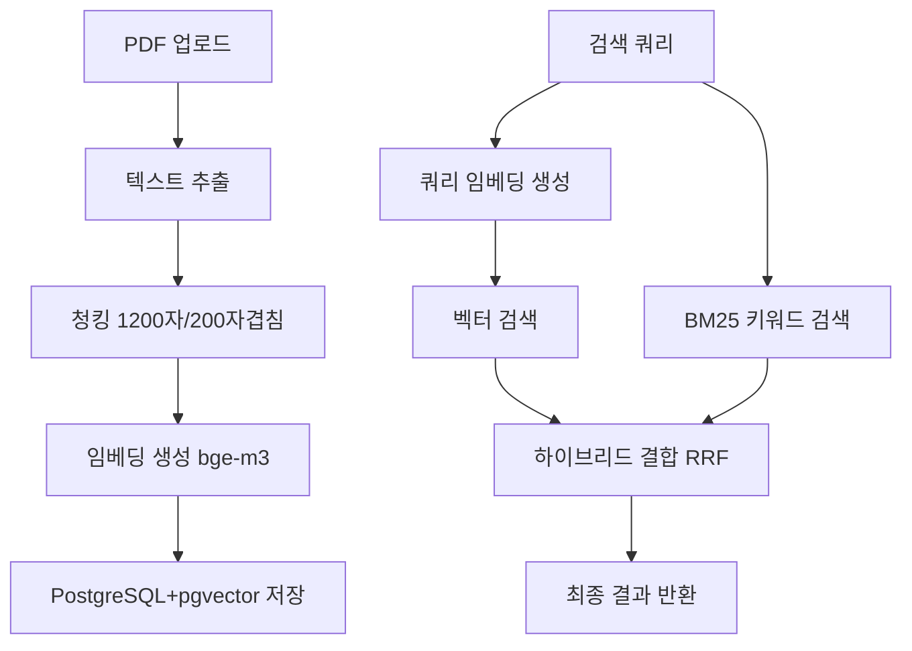

# RAG 시스템 전체 프로세스

## 📄 1. 문서 처리 및 저장

### 1.1 PDF 업로드 및 텍스트 추출
```python
# PDF → 텍스트 변환
extract_text_from_pdf(pdf_bytes) -> str
# PyPDF2 라이브러리 사용
```

### 1.2 텍스트 청킹 (Chunking)
```python
RecursiveCharacterTextSplitter(
    chunk_size=1200,        # 청크 크기 (1200자)
    chunk_overlap=200,      # 오버랩 (200자)
    separators=["\n\n", "\n", ".", "!", "?", "。", "！", "？", " ", ""]
)
```
- **목적**: 긴 문서를 검색 가능한 의미 단위로 분할
- **청크 크기**: 1200자 (의미적 맥락 보존)
- **오버랩**: 200자 (경계 정보 손실 방지)

### 1.3 임베딩 생성
```python
# Ollama API 호출
POST http://localhost:11435/api/embeddings
{
    "model": "bge-m3",
    "prompt": chunk_text
}
# 결과: 1024차원 float 벡터
```

### 1.4 벡터 저장
```sql
-- Supabase PostgreSQL + pgvector
CREATE TABLE pdf_embeddings (
    document_id TEXT,
    chunk_text TEXT,
    embedding VECTOR(1024),  -- pgvector 타입
    metadata JSONB,
    chunk_index INTEGER
);
```

## 🔍 2. 검색 시스템 (Retriever)

### 2.1 하이브리드 검색 아키텍처
```
쿼리 입력
    ↓
┌─────────────┬─────────────┐
│ 벡터 검색    │ BM25 검색    │
│ (의미적)    │ (키워드)    │
└─────────────┴─────────────┘
    ↓
하이브리드 결합 (RRF)
    ↓
최종 결과 반환
```

### 2.2 벡터 검색 알고리즘

#### A. 쿼리 임베딩 생성
```python
query_embedding = get_ollama_embedding(query)
# "주차 문제" → [0.123, -0.456, 0.789, ...] (1024차원)
```

#### B. 코사인 유사도 계산
```python
def cosine_similarity(vec1, vec2):
    dot_product = np.dot(vec1, vec2)
    norm1 = np.linalg.norm(vec1)
    norm2 = np.linalg.norm(vec2)
    return dot_product / (norm1 * norm2)
```

#### C. 유사도 임계값 필터링
```python
filtered_results = [r for r in results if r['similarity'] > 0.2]
```

### 2.3 BM25 키워드 검색 알고리즘

#### A. BM25 공식
```
BM25(q,d) = Σ IDF(qi) × (f(qi,d) × (k1 + 1)) / (f(qi,d) + k1 × (1 - b + b × |d|/avgdl))
```

**파라미터:**
- `k1 = 1.5` (term frequency saturation)
- `b = 0.75` (length normalization)
- `IDF` = Inverse Document Frequency
- `f(qi,d)` = term frequency in document
- `|d|` = document length
- `avgdl` = average document length

#### B. 토큰화 (한국어/영어 지원)
```python
def tokenize(text):
    # 한국어, 영어, 숫자만 추출
    text = re.sub(r'[^\w\s가-힣]', ' ', text)
    tokens = [t for t in text.split() if len(t) > 1]
    return tokens
```

#### C. BM25 점수 계산 과정
```python
1. 쿼리 토큰화: "주차 문제" → ["주차", "문제"]
2. 문서 컬렉션에서 각 단어의 IDF 계산
3. 각 문서별로 TF 계산
4. BM25 공식으로 최종 점수 산출
5. 점수순 정렬 및 상위 결과 선택
```

### 2.4 하이브리드 결합 (RRF - Reciprocal Rank Fusion)

#### A. 중복 제거
```python
key = f"{document_id}_{hash(chunk_text[:100])}"
# 동일한 청크는 하나로 통합
```

#### B. RRF 점수 계산
```python
def rrf_score(rank, k=60):
    return 1 / (k + rank)

vector_rrf = 1 / (60 + vector_rank)
bm25_rrf = 1 / (60 + bm25_rank)
```

#### C. 최종 점수 공식
```python
final_score = (
    vector_score × 0.6 +      # 벡터 유사도 (60%)
    bm25_score × 0.4 +        # BM25 점수 (40%)
    vector_rrf × 0.3 +        # 벡터 랭킹 보너스
    bm25_rrf × 0.2           # BM25 랭킹 보너스
)
```

## 3. 전체 데이터 흐름



## 4. 시스템 특징 및 장점

### 4.1 기술 스택
- **임베딩 모델**: Ollama bge-m3 (1024차원)
- **벡터 DB**: PostgreSQL + pgvector
- **청킹**: LangChain RecursiveCharacterTextSplitter
- **키워드 검색**: BM25 알고리즘
- **결합 방식**: RRF (Reciprocal Rank Fusion)

### 4.2 주요 장점
1. **의미적 + 키워드 검색**: 포괄적인 검색 커버리지
2. **하드코딩 제거**: 도메인 독립적 범용 시스템
3. **RPC 독립**: 직접 구현으로 안정성 확보
4. **성능 최적화**: 청크 크기 및 알고리즘 튜닝
5. **확장 가능**: 부서별 필터링, 메타데이터 활용

### 4.3 성능 지표
- **청크 크기**: 1200자 (맥락 보존)
- **임베딩 차원**: 1024차원
- **유사도 임계값**: 0.2 (관련성 필터링)
- **검색 결합비율**: 벡터 60% + BM25 40%

## 5. 추후 개선 필요 사항
1. **리랭킹 모델**: Cross-encoder 추가
2. **쿼리 확장**: LLM 기반 의도 확장
3. **성능 최적화**: RPC 함수 재활용
4. **전용 벡터DB**: Pinecone/Qdrant 고려 (대규모시)
5. **Self-RAG**: 검색 결과 품질 자동 평가

---

**마지막 업데이트**: 2025년 (BM25 하이브리드 검색 적용)